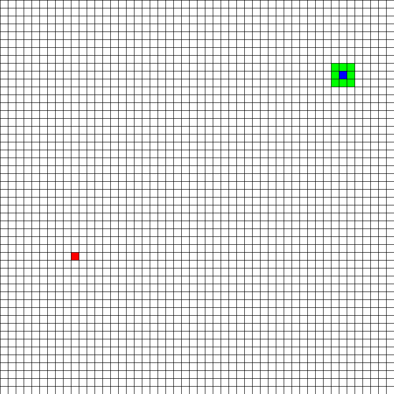
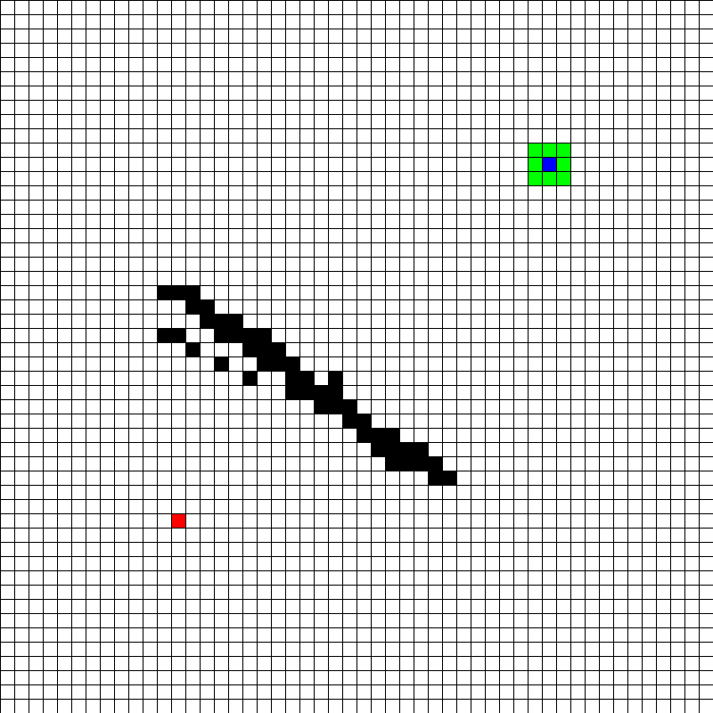
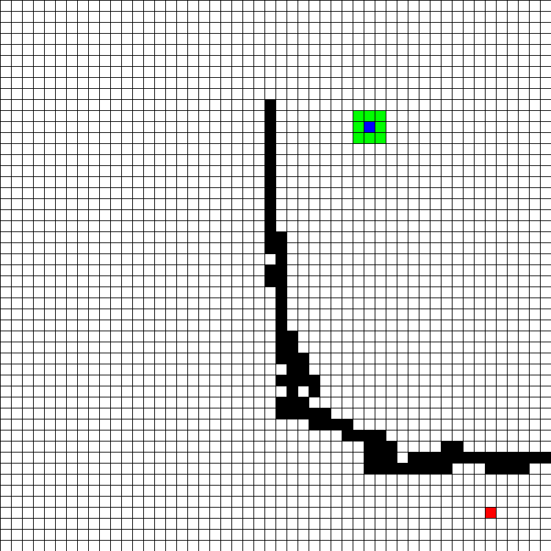
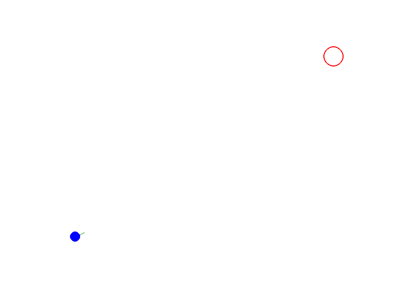
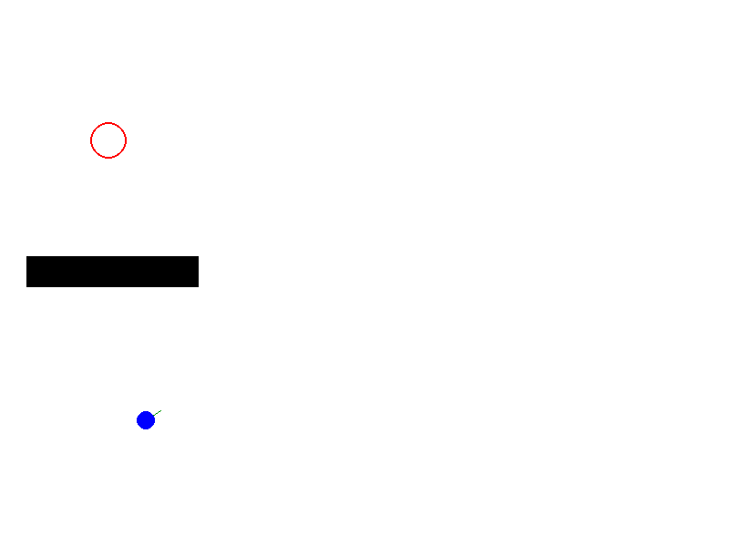
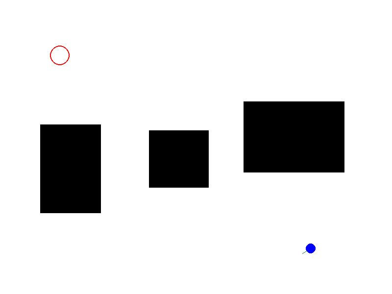

# Path Planning Visualizer: A\* Algorithm in Python

## Overview

This project is a visual implementation of the A\* (A-star) pathfinding algorithm, designed to run on a 2D grid using the Pygame library. The goal is to provide an intuitive, interactive way to explore how the A\* algorithm works, making it a valuable learning tool and portfolio piece for robotics and AI enthusiasts.

## 🔍 What is A\*?

A\* is a best-first search algorithm that finds the shortest path between two points while avoiding obstacles. It combines features of Dijkstra's algorithm and Greedy Best-First Search using the formula:

```
f(n) = g(n) + h(n)
```

* **g(n)**: Actual cost from the start node to the current node
* **h(n)**: Heuristic estimated cost from the current node to the goal

By balancing cost and heuristic, A\* efficiently finds optimal paths in graphs and grids.

## 🎯 Project Goals

* Implement A\* from scratch in Python
* Visualize the search process using Pygame
* Master fundamental path planning concepts like g-cost, h-cost, f-cost, open/closed sets
* Create an interactive tool with user-controlled start/end nodes and obstacles
* Save the search process as an animated MP4 or GIF for showcasing

## 🗂 Repository Structure

```
path-planning-visualizer/
├── astar_visualizer.py       # Main script with visualization and algorithm
├── rrt_visualizer.py         # RRT* implementation in continuous space
├── output/                   # Saved animations (.gif)
│   ├── astar_path_*.gif
│   └── rrt_star_path_*.gif
├── assets/                   # (Optional) static files
├── README.md
```

## 🚀 How to Run

### Prerequisites

```bash
pip install pygame imageio numpy
```

### Launch A\* Visualizer

```bash
python astar_visualizer.py
```

### Interactions

* **Left-click**: Place start, end, or draw barriers
* **Right-click**: Erase a node
* **Spacebar**: Start the A\* search
* **C key**: Clear the grid

### Launch RRT\* Visualizer

```bash
python rrt_visualizer.py
```

### Interactions

* **Click once**: Set **start**
* **Click again**: Set **goal**
* **Click + drag**: Draw rectangular obstacles
* **Press SPACE**: Run RRT\* and generate the optimized path

After completion, a timestamped GIF will be saved inside the `output/` folder.

## 🧠 Heuristics

The tool supports:

* **Manhattan Distance** (default)
* **Diagonal Distance** (for 8-connected movement)

The user can experiment with heuristic functions in `heuristic()` for different effects.

## 🎬 Example Outputs (A\*)

<table>
  <tr>
    <td><strong>Example 1</strong></td>
    <td><strong>Example 2</strong></td>
    <td><strong>Example 3</strong></td>
  </tr>
  <tr>
    <td></td>
    <td></td>
    <td></td>
  </tr>
</table>

## 🌲 RRT\* Path Planning in Continuous Space

In addition to grid-based A\* search, this project also includes a full implementation of the **RRT\*** (Rapidly-exploring Random Tree Star) algorithm for continuous 2D path planning. This algorithm is ideal for exploring high-dimensional, continuous spaces efficiently and then optimizing paths through a local rewiring process.

### 🎯 Project Goals

* Implement RRT and extend it to RRT\*
* Support mouse-based selection of start, goal, and obstacle placement
* Visualize the growing tree and path rewiring in real time
* Save the animation as a GIF for documentation or sharing

### 🧠 What is RRT\*?

RRT builds a tree by randomly sampling points in space and connecting them to the nearest node if the path is collision-free. RRT\* improves upon this by optimizing the tree:

* **Choose Parent**: When adding a node, connect it to the best neighbor that minimizes the cost.
* **Rewire**: After inserting a node, reconnect nearby nodes if doing so results in a lower-cost path.

This produces a tree that improves path quality over time.

### 🗂 Example Outputs (RRT\*)

<table>
  <tr>
    <td><strong>Example 1</strong></td>
    <td><strong>Example 2</strong></td>
    <td><strong>Example 3</strong></td>
  </tr>
  <tr>
    <td></td>
    <td></td>
    <td></td>
  </tr>
</table>

## 📌 Key Features

* Fully interactive grid and continuous-space interfaces
* Real-time visualization of A\* and RRT\* search processes
* 4- or 8-connected movement support for A\*
* Sampling-based motion planning and rewiring for RRT\*
* Timestamped GIF export for each run
* Clean and modular codebase for extensions

## 🔎 A\* vs RRT\* Comparison

| Feature           | A\* (Grid-based)                       | RRT\* (Continuous)      |
| ----------------- | -------------------------------------- | ----------------------- |
| Space Type        | Discrete Grid                          | Continuous 2D space     |
| Optimality        | Guaranteed (with admissible heuristic) | Asymptotically Optimal  |
| Visual Intuition  | Expanding wavefront                    | Random tree exploration |
| Application Focus | Known structured maps                  | Complex, dynamic spaces |

